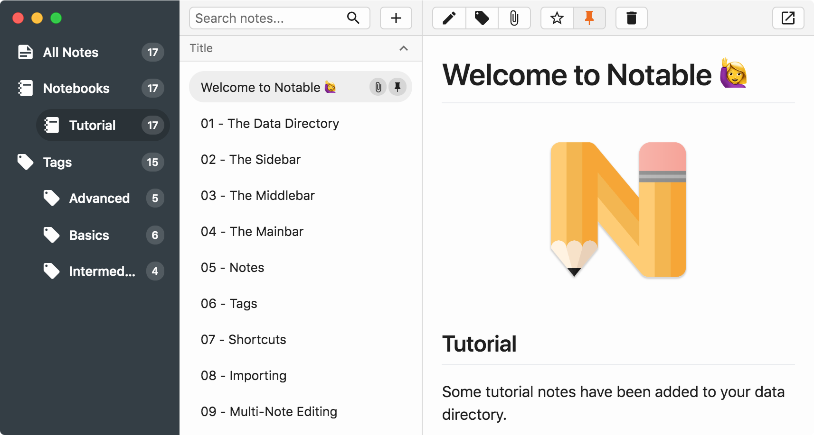
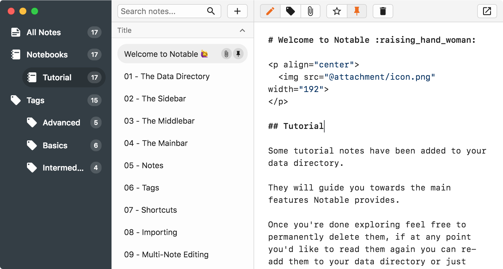
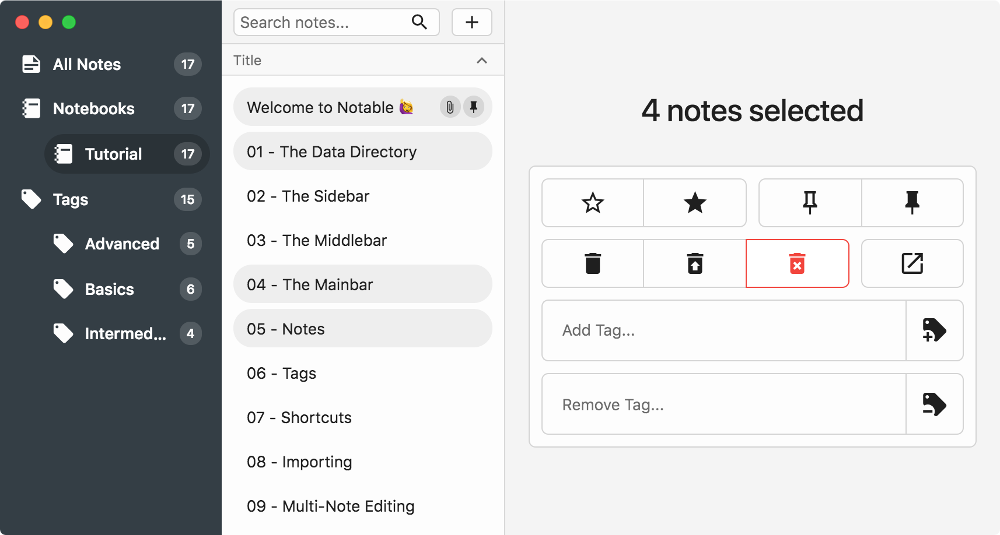

# Notable ([DOWNLOAD](https://github.com/fabiospampinato/notable/releases))

<p align="center">
  
</p>

The markdown-based note-taking app that doesn't suck.

I couldn't find a note-taking app that ticked all the boxes I'm interested in: notes are written and rendered in GitHub-flavored Markdown, no WYSIWYG, no proprietary formats, I can run a search & replace across all notes, notes support attachments, the app isn't bloated, the app has a pretty interface, tags are indefinitely nestable and can import Evernote notes (because that's what I was using before).

So I built my own.

## Features

```
/path/to/your/data_directory
├─┬ attachments
│ ├── foo.ext
│ ├── bar.ext
│ └── …
└─┬ notes
  ├── foo.md
  ├── bar.md
  └── …
```

- **No proprietary formats**: Notable is just a pretty front-end for a folder structured as shown above. Notes are plain Markdown files, their metadata is stored as Markdown front matter. Attachments are also plain files, if you attach a `picture.jpg` to a note everything about it will be preserved, and it will remain accessible like any other file.

- **Proper editor**: Notable doesn't use any WYSIWYG editor, you just write some Markdown and it gets rendered as GitHub-flavored Markdown. The built-in editor is [CodeMirror](https://codemirror.net), this means you get things like multi-cursor by default. If you need more advanced editing features with a single shortcut you can open the current note in your default Markdown editor.

- **Indefinitely nestable tags**: Pretty much all the other note-taking apps differentiate between notebooks, tags and templates. IMHO this unnecessarily complicates things. In Notable you can have root tags (`foo`), indefinitely nestable tags (`foo/bar`, `foo/.../qux`) and it still supports notebooks and templates, they are just special tags with a different icon (`Notebooks/foo`, `Templates/foo/bar`).

Upon first instantiation, some tutorial notes will be added to the app, check them out for more in-depth details about the app and how to use it.

## Comparison

```
+=============================+=================================+==============================================+======================================+=======================================+==================================================+========================================+=========================================+
|                             | Notable                         | Evernote                                     | Notion.so                            | Boostnote                             | Quiver                                           | Bear                                   | Simplenote                              |
+=============================+=================================+==============================================+======================================+=======================================+==================================================+========================================+=========================================+
| Free                        | ✔                               | △, with paid plans                           | △, with paid plans                   | ✔                                     | ✘, only during trial                             | △, with paid plans                     | ✔                                       |
+-----------------------------+---------------------------------+----------------------------------------------+--------------------------------------+---------------------------------------+--------------------------------------------------+----------------------------------------+-----------------------------------------+
| Open source                 | ✔                               | ✘                                            | ✘                                    | ✔                                     | ✘                                                | ✘                                      | ✔                                       |
+-----------------------------+---------------------------------+----------------------------------------------+--------------------------------------+---------------------------------------+--------------------------------------------------+----------------------------------------+-----------------------------------------+
| Cross platform              | ✔                               | ✔                                            | ✔                                    | ✔                                     | ✘                                                | ✘                                      | ✔                                       |
+-----------------------------+---------------------------------+----------------------------------------------+--------------------------------------+---------------------------------------+--------------------------------------------------+----------------------------------------+-----------------------------------------+
| No account required         | ✔                               | ✘                                            | ✘                                    | ✔                                     | ✔                                                | ✔                                      | ✘                                       |
+-----------------------------+---------------------------------+----------------------------------------------+--------------------------------------+---------------------------------------+--------------------------------------------------+----------------------------------------+-----------------------------------------+
| No proprietary formats      | ✔                               | △, can only export to HTML                   | ✘                                    | ✔, but notes are stored in .cson      | △, no inside Text cells                          | △, can export to Markdown              | ✘                                       |
+-----------------------------+---------------------------------+----------------------------------------------+--------------------------------------+---------------------------------------+--------------------------------------------------+----------------------------------------+-----------------------------------------+
| No WYSIWYG                  | ✔                               | ✘                                            | ✘                                    | ✔                                     | △, no inside Text cells                          | ✘, but it's a surprisingly decent one  | △, only if you set "Markdown formatted" |
+-----------------------------+---------------------------------+----------------------------------------------+--------------------------------------+---------------------------------------+--------------------------------------------------+----------------------------------------+-----------------------------------------+
| No bloat                    | ✔                               | ✘, work chat, webclipper, annotations etc... | ✘, spreadsheets, kanban board etc... | △, publish to blog, snippets          | △, presentation mode                             | ✔                                      | △, publish to website                   |
+-----------------------------+---------------------------------+----------------------------------------------+--------------------------------------+---------------------------------------+--------------------------------------------------+----------------------------------------+-----------------------------------------+
| Pretty UI                   | ✔                               | ✘                                            | ✘, too much bloat                    | ✘                                     | ✘                                                | ✔                                      | ✘                                       |
+-----------------------------+---------------------------------+----------------------------------------------+--------------------------------------+---------------------------------------+--------------------------------------------------+----------------------------------------+-----------------------------------------+
| GitHub-flavored Markdown    | ✔                               | ✘                                            | ✘                                    | ✔                                     | ✔, only within Markdown cells                    | ✘                                      | ✘                                       |
+-----------------------------+---------------------------------+----------------------------------------------+--------------------------------------+---------------------------------------+--------------------------------------------------+----------------------------------------+-----------------------------------------+
| Code syntax highlighting    | ✔                               | ✘, only generic code blocks                  | ✔                                    | ✔                                     | ✔                                                | ✔                                      | ✘, only generic code blocks             |
+-----------------------------+---------------------------------+----------------------------------------------+--------------------------------------+---------------------------------------+--------------------------------------------------+----------------------------------------+-----------------------------------------+
| Attachments                 | ✔                               | ✔, but base64 encoded in HTML when exported  | ✔, but 5MB limit on free plan        | ✘                                     | ✔                                                | ✔                                      | ✘                                       |
+-----------------------------+---------------------------------+----------------------------------------------+--------------------------------------+---------------------------------------+--------------------------------------------------+----------------------------------------+-----------------------------------------+
| Fuzzy search                | ✔                               | ✘                                            | ✘                                    | ✘                                     | ✘                                                | ✘                                      | ✘                                       |
+-----------------------------+---------------------------------+----------------------------------------------+--------------------------------------+---------------------------------------+--------------------------------------------------+----------------------------------------+-----------------------------------------+
| Indefinitely nestable tags  | ✔                               | ✘                                            | ✘                                    | ✘                                     | ✘                                                | ✔                                      | ✘                                       |
+-----------------------------+---------------------------------+----------------------------------------------+--------------------------------------+---------------------------------------+--------------------------------------------------+----------------------------------------+-----------------------------------------+
| Multi-note simple editing   | ✔                               | ✔                                            | ✘                                    | △, very limited                       | ✔                                                | ✔                                      | △, very limited                         |
+-----------------------------+---------------------------------+----------------------------------------------+--------------------------------------+---------------------------------------+--------------------------------------------------+----------------------------------------+-----------------------------------------+
| Multi-note search & replace | ✔                               | ✘                                            | ✘                                    | ✔                                     | △, with some effort, notes are stored as .qvnote | ✘                                      | ✘                                       |
+-----------------------------+---------------------------------+----------------------------------------------+--------------------------------------+---------------------------------------+--------------------------------------------------+----------------------------------------+-----------------------------------------+
| Keyboard friendly           | ✔                               | ✔                                            | ✔                                    | △, can't toggle edit and preview mode | ✘, I couldn't edit a note without the mouse      | ✔, but some shortcuts are undocumented | ✘                                       |
+-----------------------------+---------------------------------+----------------------------------------------+--------------------------------------+---------------------------------------+--------------------------------------------------+----------------------------------------+-----------------------------------------+
| Mobile app                  | ✘, but notes are Markdown files | ✔                                            | ✔                                    | ✔                                     | ✘                                                | △, only iOS                            | ✔                                       |
+-----------------------------+---------------------------------+----------------------------------------------+--------------------------------------+---------------------------------------+--------------------------------------------------+----------------------------------------+-----------------------------------------+
| Synchronization             | △, via Dropbox/etc.             | ✔                                            | ✔                                    | △, via Dropbox/etc.                   | △, via Dropbox/etc.                              | ✔                                      | ✔                                       |
+-----------------------------+---------------------------------+----------------------------------------------+--------------------------------------+---------------------------------------+--------------------------------------------------+----------------------------------------+-----------------------------------------+
| Version control             | △, via Git                      | ✘                                            | ✔, but paid                          | △, via Git                            | △, via Git, but cumbersome .qvnote format        | ✘                                      | ✔                                       |
+-----------------------------+---------------------------------+----------------------------------------------+--------------------------------------+---------------------------------------+--------------------------------------------------+----------------------------------------+-----------------------------------------+
```

Part of this comparison is personal opinion: you may disagree on the UI front, things I consider bloat may be considered features by somebody else etc. but hopefully this comparison did a good job at illustrating the main differences.

## Demo

### Editor



### Multi-Note Editor



## Contributing

If you have an idea, or you have found a problem, please open an [issue](https://github.com/fabiospampinato/notable/issues) about it.

If you want to make a pull request, or fork the app, you should:

```bash
git clone https://github.com/fabiospampinato/notable.git
cd notable
npm install
npm run svelto:dev
npm run iconfont
npm run tutorial
npm run dev
```

## Related

- **[enex-dump](https://github.com/fabiospampinato/enex-dump)**: Dump the content of Evernote's `.enex` files, preserving attachements, some metadata and optionally converting notes to Markdown.
- **[Noty](https://github.com/fabiospampinato/noty)**: Autosaving sticky note with support for multiple notes without needing multiple windows.
- **[Markdown Todo](https://marketplace.visualstudio.com/items?itemName=fabiospampinato.vscode-markdown-todo)**: Manage todo lists inside markdown files with ease. Have the same todo-related shortcuts that Notable provides, but in Visual Studio Code.
- **[Todo+](https://marketplace.visualstudio.com/items?itemName=fabiospampinato.vscode-todo-plus)**: Manage todo lists with ease. Powerful, easy to use and customizable.

## License

MIT © Fabio Spampinato
