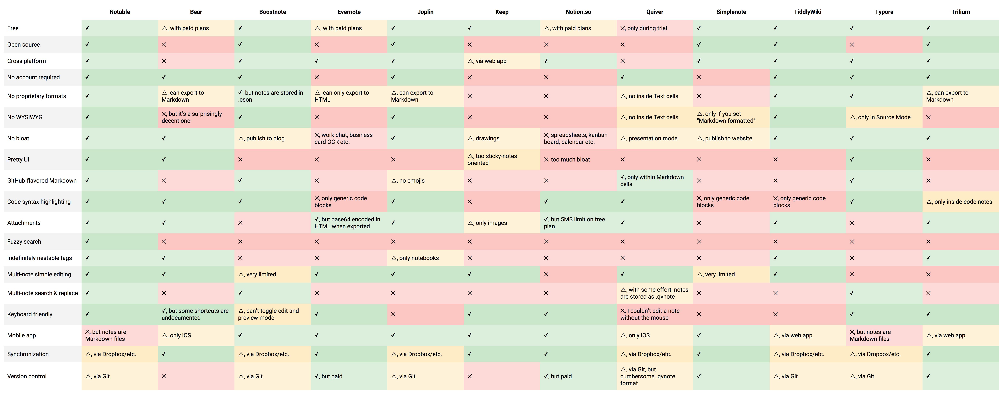
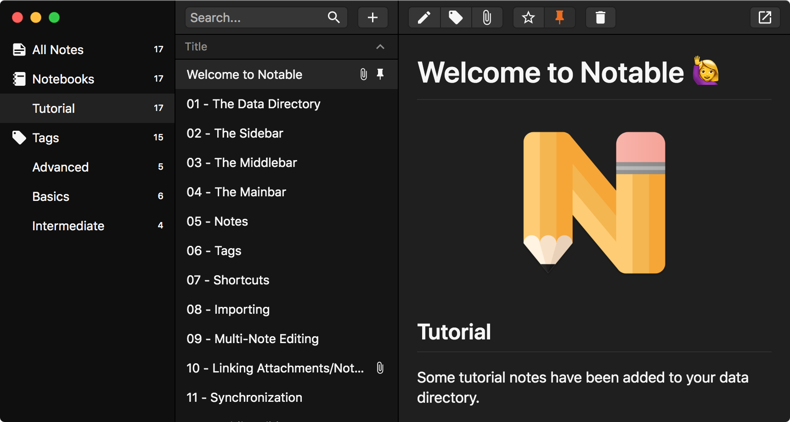
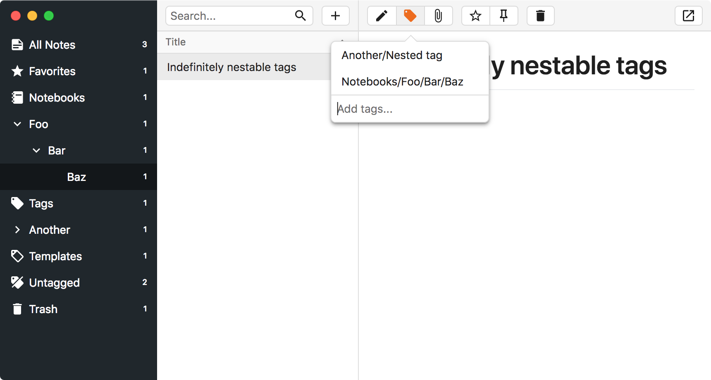
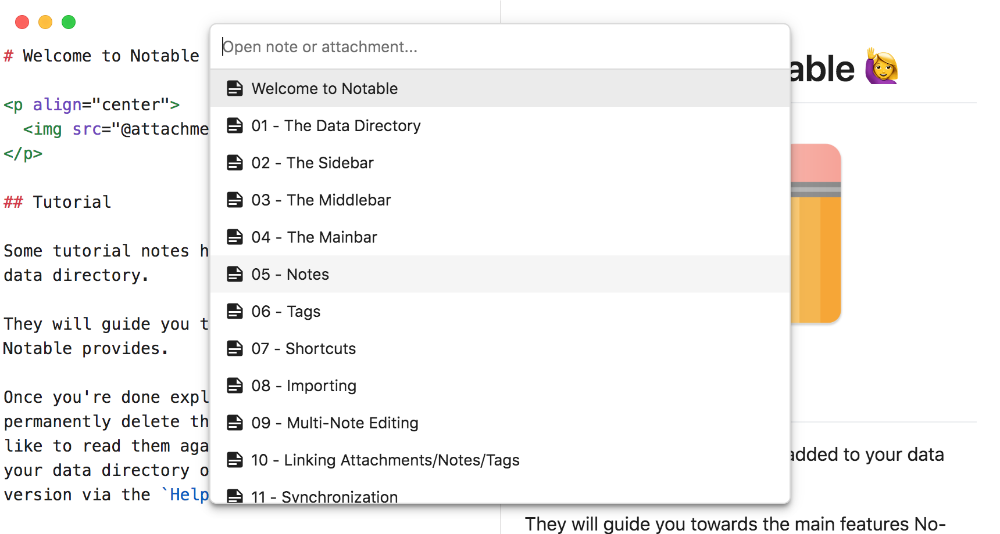

# Notable ([DOWNLOAD](https://github.com/notable/notable/releases))

<p align="center">
  
</p>

The Markdown-based note-taking app that doesn't suck.

I couldn't find a note-taking app that ticked all the boxes I'm interested in: notes are written and rendered in GitHub-Flavored Markdown, no WYSIWYG, no proprietary formats, I can run a search & replace across all notes, notes support attachments, the app isn't bloated, the app has a pretty interface, tags are indefinitely nestable and can import Evernote notes (because that's what I was using before).

So I built my own.

## Features

```
/path/to/your/data_directory
├─┬ attachments
│ ├── foo.ext
│ ├── bar.ext
│ └── …
└─┬ notes
  ├── foo.md
  ├── bar.md
  └── …
```

- **No proprietary formats**: Notable is just a pretty front-end for a folder structured as shown above. Notes are plain Markdown files, their metadata is stored as Markdown front matter. Attachments are also plain files, if you attach a `picture.jpg` to a note everything about it will be preserved, and it will remain accessible like any other file.

- **Proper editor**: Notable doesn't use any WYSIWYG editor, you just write some Markdown and it gets rendered as GitHub-Flavored Markdown. The built-in editor is [Monaco Editor](https://github.com/Microsoft/monaco-editor), the same one VS Code uses, this means you get things like multi-cursor by default. If you need more advanced editing features with a single shortcut you can open the current note in your default Markdown editor.

- **Indefinitely nestable tags**: Pretty much all other note-taking apps differentiate between notebooks, tags and templates. IMHO this unnecessarily complicates things. In Notable you can have root tags (`foo`), indefinitely nestable tags (`foo/bar`, `foo/.../qux`) and it still supports notebooks and templates, they are just special tags with a different icon (`Notebooks/foo`, `Templates/foo/bar`).

Upon first instantiation, some tutorial notes will be added to the app, check them out for more in-depth details about the app and how to use it. You can also find the raw version [here](https://github.com/notable/notable/tree/v1.7.0/resources/tutorial/notes).

## [Comparison](resources/comparison/table.png?raw=true)

[](resources/comparison/table.png?raw=true)

Part of this comparison is personal opinion: you may disagree on the UI front, things I consider bloat may be considered features by somebody else etc. but hopefully this comparison did a good job at illustrating the main differences.

## Demo

### Dark Theme



### Indefinitely Nestable Tags



### Editor


### Multi-Note Editor


### Split-Editor + Zen Mode + Quick Open



## Contributing

There are multiple ways to contribute to this project, read about them [here](https://github.com/notable/notable/blob/master/.github/CONTRIBUTING.md).

## Related

- **[dumper](https://github.com/fabiospampinato/enex-dump)**: Library for extracting attachments, notes and metadata out of formats used by popular note-taking apps.

## License

- **<= v1.3.0**: MIT © Fabio Spampinato.
- **<= v1.5.1**: AGPLv3 © Fabio Spampinato.
- **>= v1.6.0**: Not open-source. Notable has effectively become my full-time job, so I've decided to figure out how to make it sustainable first before figuring out how to license it, in order to make this less risky for me. Read more about this [here](https://github.com/notable/notable/issues/432) and [here](https://www.reddit.com/r/Notable/comments/bu86e8/update_on_v160/).
