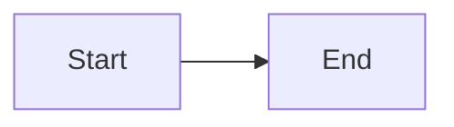

# Markdown Cheatsheet

## Heading

<div class="multiple joined equal">
  <div class="container bordered">
    <markdown>
``````markdown
# Heading 1

## Heading 2

### Heading 3

#### Heading 4

##### Heading 5

###### Heading 6
``````
    </markdown>
  </div>
  <div class="container bordered">
    <markdown>
# Heading 1

## Heading 2

### Heading 3

#### Heading 4

##### Heading 5

###### Heading 6
    </markdown>
  </div>
</div>

<div class="multiple joined equal">
  <div class="container bordered">
    <markdown>
``````markdown
Heading 1
=========

Heading 2
---------
``````
    </markdown>
  </div>
  <div class="container bordered">
    <markdown>
Heading 1
=========

Heading 2
---------
    </markdown>
  </div>
</div>

## Formatting

<div class="multiple joined equal">
  <div class="container bordered">
    <markdown>
``````markdown
_Italic_
*Italic*
__Bold__
**Bold**
~~Strikethrough~~
Subscript~example~
Superscript^example^
``````
    </markdown>
  </div>
  <div class="container bordered">
    <markdown>
_Italic_
*Italic*
__Bold__
**Bold**
~~Strikethrough~~
Subscript~example~
Superscript^example^
    </markdown>
  </div>
</div>

## List

<div class="multiple joined equal">
  <div class="container bordered">
    <markdown>
``````markdown
- Unordered list

+ Unordered list

* Unordered list

- Nested
  - Unordered
  - List
``````
    </markdown>
  </div>
  <div class="container bordered">
    <markdown>
- Unordered list

+ Unordered list

* Unordered list

- Nested
  - Unordered
  - List
    </markdown>
  </div>
</div>

<div class="multiple joined equal">
  <div class="container bordered">
    <markdown>
``````markdown
1. Ordered list

1) Ordered list

1. Nested
   1. Ordered
   2. List
``````
    </markdown>
  </div>
  <div class="container bordered">
    <markdown>
1. Ordered list

1) Ordered list

1. Nested
   1. Ordered
   2. List
    </markdown>
  </div>
</div>

## Task

<div class="multiple joined equal">
  <div class="container bordered">
    <markdown>
``````markdown
+ [ ] Unchecked task

* [x] Checked task

- [ ] Nested
  - [x] Checked
  - [ ] Task
``````
    </markdown>
  </div>
  <div class="container bordered">
    <markdown>
+ [ ] Unchecked task

* [x] Checked task

- [ ] Nested
  - [x] Checked
  - [ ] Task
    </markdown>
  </div>
</div>

## Link

<div class="multiple joined equal">
  <div class="container bordered">
    <markdown>
``````markdown
[Link](bit.ly/2RobkpZ)
[Link reference][1]

[1]: bit.ly/2RobkpZ
``````
    </markdown>
  </div>
  <div class="container bordered">
    <markdown>
[Link](bit.ly/2RobkpZ)
[Link reference][1]

[1]: bit.ly/2RobkpZ
    </markdown>
  </div>
</div>

## Auto-linking

<div class="multiple joined equal">
  <div class="container bordered">
    <markdown>
``````markdown
www.google.com
larry@google.com
``````
    </markdown>
  </div>
  <div class="container bordered">
    <markdown>
www.google.com
larry@google.com
    </markdown>
  </div>
</div>

## Footnote

<div class="multiple joined equal">
  <div class="container bordered">
    <markdown>
``````markdown
Numeric [^1]
Alphanumeric [^fn]
Inline ^[Inline content]

[^1]: Numeric content
[^fn]: Alphanumeric content
``````
    </markdown>
  </div>
  <div class="container bordered">
    <markdown>
Numeric [^1]
Alphanumeric [^fn]
Inline ^[Inline content]

[^1]: Numeric content
[^fn]: Alphanumeric content
    </markdown>
  </div>
</div>

## Image

<div class="multiple joined equal">
  <div class="container bordered">
    <markdown>
``````markdown

![Image reference][1]
[![Image reference + Link][1]][1]

[1]: https://bit.ly/2Y3NhTM
``````
    </markdown>
  </div>
  <div class="container bordered">
    <markdown>

![Image reference][1]
[![Image reference + Link][1]][1]

[1]: https://bit.ly/2Y3NhTM
    </markdown>
  </div>
</div>

## Quotation

<div class="multiple joined equal">
  <div class="container bordered">
    <markdown>
``````markdown
> Quotation
> > Nested quotation
``````
    </markdown>
  </div>
  <div class="container bordered">
    <markdown>
> Quotation
> > Nested quotation
    </markdown>
  </div>
</div>

## Code

<div class="multiple joined equal">
  <div class="container bordered">
    <markdown>
``````markdown
`Inline code`

    Unfenced code block

```
Fenced code block
```

~~~
Fenced code block
~~~

```js
// Fenced JS code block
```
``````
    </markdown>
  </div>
  <div class="container bordered">
    <markdown>
`Inline code`

    Unfenced code block

```
Fenced code block
```

~~~
Fenced code block
~~~

```js
// Fenced JS code block
```
    </markdown>
  </div>
</div>

## Table

<div class="multiple joined equal">
  <div class="container bordered">
    <markdown>
``````markdown
#### Regular

| Tables | Are | Great |
| ------ | --- | ----- |
| •      | •   | •     |
| •      | •   | •     |

#### Aligned

| Left | Center | Right |
| :--- | :----: | ----: |
| •    | •      | •     |
``````
    </markdown>
  </div>
  <div class="container bordered">
    <markdown>
#### Regular

| Tables | Are | Great |
| ------ | --- | ----- |
| •      | •   | •     |
| •      | •   | •     |

#### Aligned

| Left | Center | Right |
| :--- | :----: | ----: |
| •    | •      | •     |
    </markdown>
  </div>
</div>

## Separator

<div class="multiple joined equal">
  <div class="container bordered">
    <markdown>
``````markdown
---
***
___
``````
    </markdown>
  </div>
  <div class="container bordered">
    <markdown>
---
***
___
    </markdown>
  </div>
</div>

## Emoji

All emojis supported by GitHub are supported, you can find a list of them under `Help -> View Emojis`.

<div class="multiple joined equal">
  <div class="container bordered">
    <markdown>
``````markdown
:smile: :+1:
``````
    </markdown>
  </div>
  <div class="container bordered">
    <markdown>
:smile: :+1:
    </markdown>
  </div>
</div>

## KaTeX

KaTeX implements the LaTeX language, which is used for writing mathematical expressions among other things, read more about them [here](https://www.latex-project.org/help/documentation) and [here](https://katex.org/docs/supported.html).

<div class="multiple joined equal">
  <div class="container bordered">
    <markdown>
``````markdown
#### Inline

$e^{iπ} + 1 = 0$

#### Block

$$e^{iπ} + 1 = 0$$

#### Multi-line Block

$$
\begin{pmatrix}
   f(\alpha) & b \\
   a         & f(\beta)
\end{pmatrix}
$$

#### Code Block

```katex
e^{iπ} + 1 = 0
```
``````
    </markdown>
  </div>
  <div class="container bordered">
    <markdown>
#### Inline

$e^{iπ} + 1 = 0$

#### Block

$$e^{iπ} + 1 = 0$$

#### Multi-line Block

$$
\begin{pmatrix}
   f(\alpha) & b \\
   a         & f(\beta)
\end{pmatrix}
$$

#### Code Block

```katex
e^{iπ} + 1 = 0
```
    </markdown>
  </div>
</div>

## MhChem

MhChem is a LaTeX language extension supported by KaTeX, it is used for writing chemical expressions, read its documentation [here](https://mhchem.github.io/MathJax-mhchem).

<div class="multiple joined equal">
  <div class="container bordered">
    <markdown>
``````markdown
#### Inline

$\ce{ H2O }$

#### Block

$$\ce{ H2O }$$
``````
    </markdown>
  </div>
  <div class="container bordered">
    <markdown>
#### Inline

$\ce{ H2O }$

#### Block

$$\ce{ H2O }$$
    </markdown>
  </div>
</div>

## AsciiMath

AsciiMath is a language for writing mathematical expressions using only ASCII characters, read its documentation [here](http://asciimath.org).

<div class="multiple joined equal">
  <div class="container bordered">
    <markdown>
``````markdown
#### Inline

&e = mc^2&

#### Block

&&e = mc^2&&

#### Code Block

```asciimath
e = mc^2
```
``````
    </markdown>
  </div>
  <div class="container bordered">
    <markdown>
#### Inline

&e = mc^2&

#### Block

&&e = mc^2&&

#### Code Block

```asciimath
e = mc^2
```
    </markdown>
  </div>
</div>

## Mermaid

Mermaid is a language for generating flowcharts and diagrams, read its documentation [here](http://knsv.github.io/mermaid).

<div class="multiple joined equal">
  <div class="container bordered">
    <markdown>
``````markdown

``````
    </markdown>
  </div>
  <div class="container bordered">
    <markdown>

    </markdown>
  </div>
</div>

## Deep Linking

The following custom syntaxes are supported for linking to various things inside the app: attachments, notes, tags and search queries.

<div class="multiple joined equal">
  <div class="container bordered">
    <markdown>
``````markdown
#### Attachment


[Icon](@attachment/example.png)

[](@attachment/example.png)

#### Note

[Example](@note/Example.md)

[](@note/Example.md)

[[Title|Example.md]]

[[Example]]

#### Tag

[Basics](@tag/Basics)

[](@tag/Basics)

#### Search

[linking](@search/linking)

[](@search/linking)
``````
    </markdown>
  </div>
  <div class="container bordered">
    <markdown>
#### Attachment


[Icon](@attachment/example.png)

[](@attachment/example.png)

#### Note

[Example](@note/Example.md)

[](@note/Example.md)

[[Title|Example.md]]

[[Example]]

#### Tag

[Basics](@tag/Basics)

[](@tag/Basics)

#### Search

[linking](@search/linking)

[](@search/linking)
    </markdown>
  </div>
</div>

## `<markdown>` Tag

A custom `<markdown>` HTML tag is supported. Anything written inside it will be rendered as Markdown. This is particularly useful when you have to write some wrapper HTML but you still want to write Markdown inside it.

<div class="multiple joined equal">
  <div class="container bordered">
    <markdown>
``````markdown
<details>
  <summary>Summary...</summary>
  <markdown>
- Embedded
  - _Markdown_
  </markdown>
</details>
``````
    </markdown>
  </div>
  <div class="container bordered">
    <details>
      <summary>Summary...</summary>
      <markdown>
- Embedded
  - _Markdown_
      </markdown>
    </details>
  </div>
</div>

## HTML

HTML can be written inside Markdown. The following are some useful HTML tags that you might want to know for which there's no Markdown-specific syntax.

<div class="multiple joined equal">
  <div class="container bordered">
    <markdown>
``````markdown
<!-- Comment -->

#### Abbreviation

<abbr title="Mister">Mr.</abbr>

#### Center

<center>Center</center>
<p align="center">Center</p>

#### Description List

<dl>
 <dt>Mr.</dt>
 <dd>Mister</dd>
</dl>

#### Details

<details>
  <summary>Summary...</summary>
  Details...
</details>

#### Keyboard

<kbd>Ctrl+F5</kbd>

#### Mark

<mark>Text</mark>

#### Small

<small>Text</small>
``````
    </markdown>
  </div>
  <div class="container bordered">
    <markdown>
<!-- Comment -->

#### Abbreviation

<abbr title="Mister">Mr.</abbr>

#### Center

<center>Center</center>
<p align="center">Center</p>

#### Description List

<dl>
 <dt>Mr.</dt>
 <dd>Mister</dd>
</dl>

#### Details

<details>
  <summary>Summary...</summary>
  Details...
</details>

#### Keyboard

<kbd>Ctrl+F5</kbd>

#### Mark

<mark>Text</mark>

#### Small

<small>Text</small>
    </markdown>
  </div>
</div>
