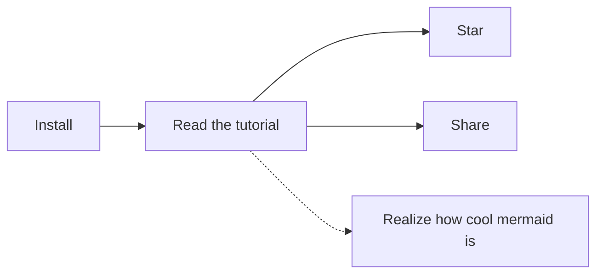

# 05 - Notes

## Syntax

Notes are written in [GitHub-Flavored Markdown](https://guides.github.com/features/mastering-markdown), so you can write emojis (`:joy:` -> :joy:), ~~strikethrough~~ text etc. in a familiar fashion, additionally you can also write subscripts~example~, superscripts^example^ and footnotes[^1].

[^1]: This is a footnote, you don't need to manually write it at the bottom of the document.

This also means that your notes aren't locked into any proprietary format.

Notes can have some metadata: if they are favorited or not, which tags they have, which attachments they have, etc. These metadata are written as Markdown front matter. This is taken care of for you.

## Syntax Plugins

Some syntax plugins for providing you [KaTeX](https://katex.org), [AsciiMath](http://asciimath.org) and [mermaid](https://github.com/knsv/mermaid) support are built-in, check out this note's source.

#### KaTeX

Wrap a formula in `$$` to display it as a block:

$$f{x} = \int_{-\infty}^\infty \hat f\xi\,e^{2 \pi i \xi x} \,d\xi$$

Multi-line block formulas are supported too:

$$
\begin{pmatrix}
   f(\alpha) & b        & c         \\
   e         & f(\beta) & g         \\
   i         & j        & f(\gamma)
\end{pmatrix}
$$

Wrap it in `$` to display it inline: $e^{iπ} + 1 = 0$.

The [mhchem](https://mhchem.github.io/MathJax-mhchem) syntax for writing chemical expressions is supported too:

$$\ce{ SO4^2- + Ba^2+ -> BaSO4 v }$$

> **Note**: In order to minimize conflicts there mustn't be spaces at the beginning and end of a single-line formula, and the ending `$` character musn't be followed by a digit. If you need to you can escape the `$` character with a backslash.

> **Note**: If your formula contains a `$`, you will have to wrap it in either double `$$` or a code block in order to avoid clonflicts.

#### AsciiMath

Wrap a formula in `&&` to display it as a block:

&&sum_(i=1)^n i^3=((n(n+1))/2)^2&&

Wrap it in `&` to display it inline: &e = mc^2&.

> **Note**: In order to minimize conflicts there mustn't be spaces at the beginning and end of a formula, and the ending `&` character musn't be followed by a digit. If you need to you can escape the `&` character with a backslash.

#### mermaid

#### `<markdown>` Tag

Notable supports a custom `<markdown>` HTML tag. Anything written inside it will be rendered as Markdown. This is particularly useful when you have to write raw HTML but you still want to write Markdown inside it, like when using the `
` tag or when writing tables with multi-line content inside cells.

  
Click to show more...

  <markdown>
- Embedded
  - _Markdown_
  </markdown>

## Attachments

Notes can have attachments, because sooner or later you'll want to save a file in a note, be it a boarding pass for your next trip or something else.

Attachments can be added by clicking the attachment icon in the mainbar's toolbar. Attachments are simply copied into your data directory, under the `attachments` sub-directory.

You can open/remove them at any time.
